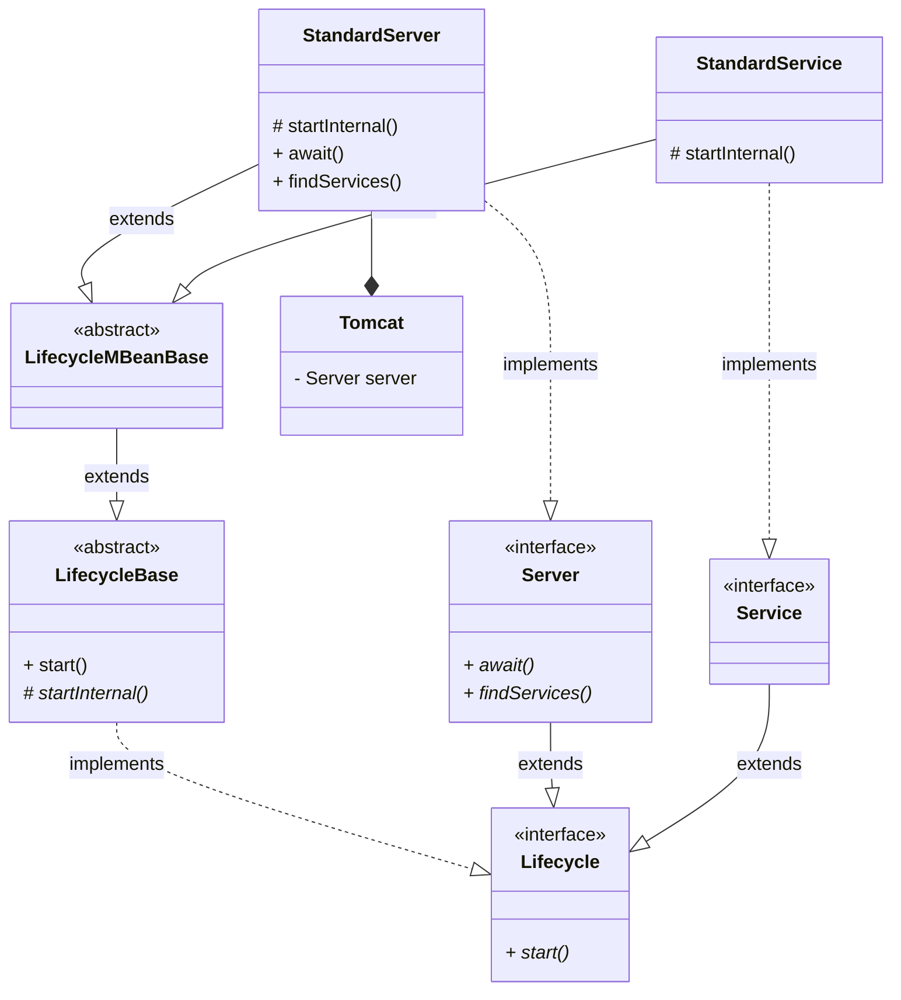
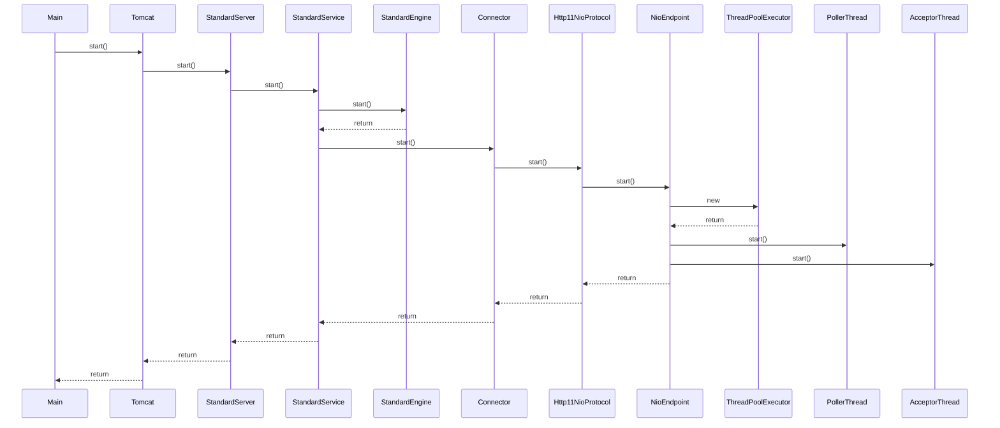

# 起動

## クラス図

```mermaid
classDiagram
    class Lifecycle {
        <<interface>>
        + start()*
    }
    class LifecycleBase {
        <<abstract>>
        + start()
        # startInternal()*
    }
    LifecycleBase ..|> Lifecycle : implements
    class LifecycleMBeanBase {
        <<abstract>>
    }
    LifecycleMBeanBase --|> LifecycleBase : extends
    class Server {
        <<interface>>
        + await()*
        + findServices()*
    }
    Server --|> Lifecycle : extends
    class StandardServer {
        # startInternal()
        + await()
        + findServices()
    }
    StandardServer --|> LifecycleMBeanBase : extends
    StandardServer ..|> Server : implements
    class Tomcat {
        - Server server
    }
    StandardServer --* Tomcat
    class Service {
        <<interface>>
    }
    Service --|> Lifecycle : extends
    class StandardService {
        # startInternal()
    }
    StandardService --|> LifecycleMBeanBase : extends
    StandardService ..|> Service : implements
    
```

## シーケンス図

```mermaid
sequenceDiagram
    Main ->> Tomcat: start()
    Tomcat ->> StandardServer: start()
    StandardServer ->> StandardService: start()
    StandardService ->> StandardEngine: start()
    StandardEngine -->> StandardService: return
    StandardService ->> Connector: start()
    Connector ->> Http11NioProtocol: start()
    Http11NioProtocol ->> NioEndpoint: start()
    NioEndpoint ->> ThreadPoolExecutor: new
    ThreadPoolExecutor -->> NioEndpoint: return
    NioEndpoint ->> PollerThread: start()
    NioEndpoint ->> AcceptorThread: start()
    NioEndpoint -->> Http11NioProtocol: return
    Http11NioProtocol -->> Connector: return
    Connector -->> StandardService: return
    StandardService -->> StandardServer: return
    StandardServer -->> Tomcat: return
    Tomcat -->> Main: return
```

# リクエスト・レスポンス

# シャットダウン
