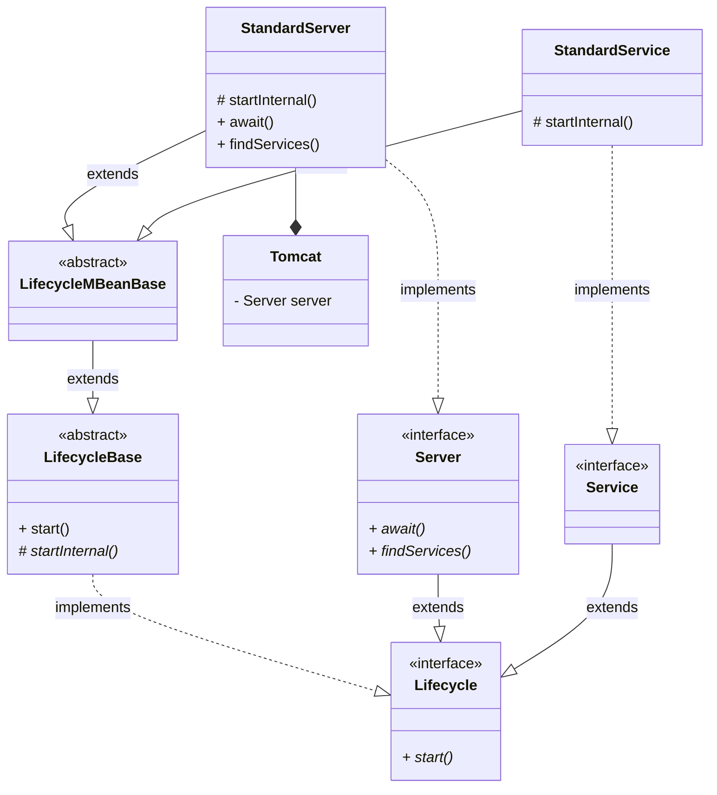

```mermaid
classDiagram
    class Lifecycle {
        <<interface>>
        + start()*
    }
    class LifecycleBase {
        <<abstract>>
        + start()
        # startInternal()*
    }
    LifecycleBase ..|> Lifecycle : implements
    class LifecycleMBeanBase {
        <<abstract>>
    }
    LifecycleMBeanBase --|> LifecycleBase : extends
    class Server {
        <<interface>>
        + await()*
        + findServices()*
    }
    Server --|> Lifecycle : extends
    class StandardServer {
        # startInternal()
        + await()
        + findServices()
    }
    StandardServer --|> LifecycleMBeanBase : extends
    StandardServer ..|> Server : implements
    class Tomcat {
        - Server server
    }
    StandardServer --* Tomcat
    class Service {
        <<interface>>
    }
    Service --|> Lifecycle : extends
    class StandardService {
        # startInternal()
    }
    StandardService --|> LifecycleMBeanBase : extends
    StandardService ..|> Service : implements
    
```